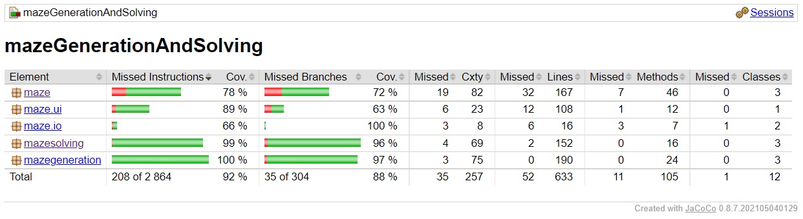
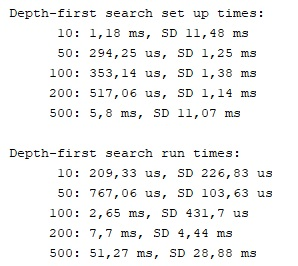
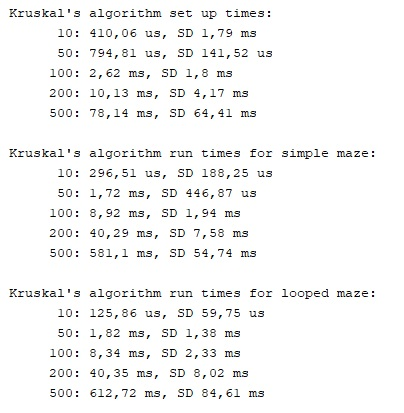
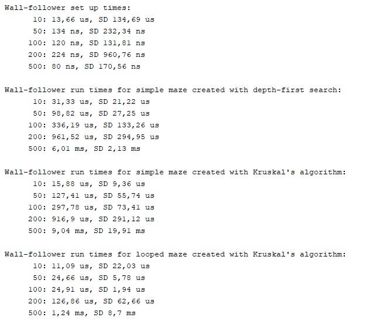
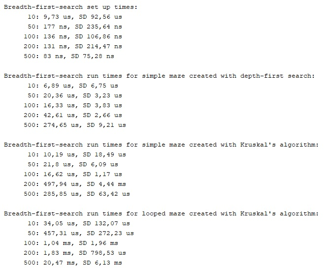

# Testaus

Sovellukselle on olemassa yksikkötestit sekä Cucumber-testit, jotka testaavat käyttöliittymän toimintaa. Nämä testit suoritetaan test-komennon avulla. Lisäksi ohjelmalle on suorituskykytestit, jotka suoritetaan käyttöliittymästä. Ne vertaavat eri algoritmien valmisteluun ja ajoon kuluvia aikoja ja laskevat näistä sadan ajon keskiarvot ja keskihajonnat.


## Sovelluksen testaus

Sovelluksen testaus yksikkötestien ja Cucumber-testien avulla.

```
gradle test
```


Jacoco-testikattavuusraportin luominen:
```
gradle test jacocoTestReport
```


Checkstyle-raportin luominen
```
gradle test checkstyleMain
```


## Testikattavuusraportti 

Testattu 5.9.2021




## Suorituskyvyn testaus 

Testasin suorituskykyä viidellä eri kokoisella labyrintillä: 10 x 10, 50 x 50, 100 x 100, 200 x 200 ja 500 x 500 ruutua. Tein 100 testiajoa kutakin algoritmia ja kutakin labyrinttikokoa kohden. Tallensin testiajoista algoritmin esivalmisteluihin sekä sen suorittamiseen kuluvan ajan ja laskin niistä keskiarvon ja keskihajonnan.


Syvyyshaun tulokset: <br>

<br>

Kruskalin algoritmin tulokset: <br>

<br>

Wallfollower-algoritmin tulokset: <br>

<br>

Leveyshaun tulosket: <br>



## Lähteet

Otin suorituskykytesteihin mallia kurssin esimerkkiprojektin suorituskykytesteistä.